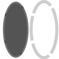

# Mejoras de Accesibilidad y Usabilidad - Proyecto Orticom Tech

## Resumen Ejecutivo

Se han implementado mejoras significativas de accesibilidad y usabilidad en el sitio web de Orticom Tech, siguiendo estándares WCAG 2.1 AA y mejores prácticas de desarrollo web accesible. Las mejoras incluyen etiquetas semánticas HTML5, atributos ARIA (Accessible Rich Internet Applications) y mejoras visuales para facilitar la navegación y uso de la plataforma.

---

## 1. Skip Link (Enlace para Saltar Contenido)

### Problema Identificado
Los usuarios que dependen de navegación por teclado tenían que pasar por toda la cabecera antes de llegar al contenido principal.

### Solución Implementada
✅ Agregado enlace "Skip Link" al inicio de cada página HTML
- Ubicado al principio del `<body>`
- Solo visible cuando se obtiene el foco (mediante `focus`)
- Enlaza directamente a `id="main"` en el elemento principal

### Código Ejemplo
```html
<body>
    <!-- Skip Link para accesibilidad -->
    <a href="#main" class="skipLink">Ir al contenido principal</a>
    <header class="cabecera">
        <!-- contenido -->
    </header>
    <main id="main">
        <!-- contenido principal -->
    </main>
</body>
```

### Estilos CSS
```css
.skipLink {
    position: absolute;
    left: -9999px;
    z-index: 999;
    padding: 1em;
    background: var(--amarillo);
    color: var(--negro);
    text-decoration: none;
    border-radius: 0 0 4px 4px;
}

.skipLink:focus {
    left: 50%;
    transform: translateX(-50%);
    top: 0;
}
```

### Archivos Modificados
- `index.html`
- `busqueda.html`
- `contacto.html`
- `producto.html`
- `destacados.html`

---

## 2. Formulario de Búsqueda Accesible

### Problema Identificado
El buscador tenía un `<span>` con un SVG en lugar de un botón accesible. Los usuarios de lectores de pantalla no podían enviar la búsqueda.

### Solución Implementada
✅ Cambio de estructura del buscador:
- Convertir `<span class="buscadorIcono">` a `<button type="submit">`
- Agregar `aria-label="Buscar"` al botón
- Agregar `aria-label` al input de búsqueda
- Agregar `<label class="sr-only">` para descripción accesible
- Agregar `aria-hidden="true"` al SVG

### Código Antes
```html
<form action="busqueda.html" method="post">
    <input type="text" class="buscadorInput" placeholder="Buscar...">
    <span class="buscadorIcono">
        <svg><!-- icono --></svg>
    </span>
</form>
```

### Código Después
```html
<form action="busqueda.html" method="post" aria-label="Formulario de búsqueda">
    <label for="buscadorInput" class="sr-only">Buscar productos</label>
    <input type="text" id="buscadorInput" class="buscadorInput" 
           placeholder="Buscar..." aria-label="Campo de búsqueda">
    <button type="submit" class="buscadorIcono" aria-label="Buscar">
        <svg aria-hidden="true"><!-- icono --></svg>
    </button>
</form>
```

### Estilos CSS Mejorados
```css
.buscadorIcono {
    position: absolute;
    left: 8px;
    color: var(--negro);
    display: flex;
    align-items: center;
    justify-content: center;
    top: 50%;
    transform: translateY(-50%);
    background: none;
    border: none;
    padding: 4px;
    cursor: pointer;
    transition: all 0.3s ease;
}

.buscadorIcono:hover {
    color: var(--azulon);
}

.buscadorIcono:focus-visible {
    outline: 2px solid var(--azulon);
    outline-offset: 1px;
    border-radius: 4px;
}
```

---

## 3. Menú Hamburguesa Mejorado

### Problema Identificado
El checkbox para el menú móvil no tenía atributos ARIA que indicaran su estado o propósito.

### Solución Implementada
✅ Agregados atributos ARIA al checkbox:
- `aria-expanded="false"` - Indica si el menú está expandido o no
- `aria-controls="menuNavegacion"` - Vincula el control con el elemento que controla
- Agregado `id="menuNavegacion"` al contenedor del menú

### Código Ejemplo
```html
<input type="checkbox" id="abrirMenu" class="abrirMenu" 
       aria-expanded="false" aria-controls="menuNavegacion">

<div class="menuNavegacion" id="menuNavegacion">
    <nav class="navegacion">
        <!-- enlaces de navegación -->
    </nav>
</div>
```

---

## 4. Indicador de Página Actual en Navegación

### Problema Identificado
No había forma de saber visualmente cuál era la página actual en el menú de navegación.

### Solución Implementada
✅ Agregado `aria-current="page"` al enlace de la página actual
- Indica a lectores de pantalla que es la página actual
- Estilado con CSS para resaltarlo visualmente

### Código Ejemplo
```html
<!-- En index.html -->
<a href="index.html" aria-current="page">HOME</a>

<!-- En producto.html -->
<a href="producto.html" aria-current="page">PRODUCTOS</a>

<!-- En contacto.html -->
<a href="contacto.html" aria-current="page">CONTACTO</a>

<!-- En destacados.html -->
<a href="destacados.html" aria-current="page">DESTACADOS</a>
```

### Estilos CSS
```css
a[aria-current="page"] {
    font-weight: 700;
    text-decoration: underline;
    color: var(--rojito);
}
```

---

## 5. Modales/Lightbox de Imágenes Accesibles

### Problema Identificado
Las imágenes ampliadas (lightbox) no tenían atributos ARIA que las identificaran como diálogos modales.

### Solución Implementada
✅ Transformación de enlaces cerrador a botones accesibles
✅ Agregados atributos ARIA a los contenedores de imágenes ampliadas:
- `role="dialog"` - Identifica como diálogo
- `aria-modal="true"` - Indica que es un modal
- `aria-labelledby="ID"` - Vincula a la etiqueta descriptiva
- Cambio de `<a href="#" class="cerrarImagen">` a `<button class="cerrarImagen" aria-label="Cerrar imagen ampliada">`

### Código Antes
```html
<div id="imgProducto1" class="imagenAmpliada">
    <a href="#producto1" class="cerrarImagen"></a>
    
</div>
```

### Código Después
```html
<div id="imgProducto1" class="imagenAmpliada" 
     role="dialog" aria-modal="true" aria-labelledby="imgProducto1-label">
    <h3 id="imgProducto1-label" class="sr-only">
        Imagen ampliada: Aplicación Finan v1.2
    </h3>
    <button class="cerrarImagen" aria-label="Cerrar imagen ampliada"></button>
    
</div>
```

### Archivos Modificados
- `index.html` - 5 lightbox actualizados
- `producto.html` - 5 lightbox actualizados

---

## 6. Elementos Canvas Accesibles

### Solución Implementada
✅ Canvas ya tenía `role="img"` y `aria-label` correctamente implementados
- El canvas de la página destacados tiene descripción accesible
- Permite a lectores de pantalla entender el contenido visual

### Código Ejemplo
```html
<div class="contenedorCanvasEstatico" role="img" 
     aria-label="Canvas estatico con el logo de Orticom">
    <canvas id="canvasDestacados" class="canvasDestacados" 
            width="920" height="280"></canvas>
</div>
```

---

## 7. Iframes con Títulos y Atributos ARIA

### Solución Implementada
✅ Mejora de iframes en página de contacto:
- Agregado `aria-label` descriptivo
- Mejorado el atributo `title`
- Agregado `title` en YouTube iframe

### Código Ejemplo
```html
<!-- Mapa de Google -->
<iframe src="https://www.google.com/maps?q=..." 
        loading="lazy" 
        title="Mapa de ubicación de Orticom Tech en Pechina"
        referrerpolicy="no-referrer-when-downgrade" 
        aria-label="Mapa interactivo de Google Maps"></iframe>

<!-- Video YouTube -->
<iframe width="560" height="315" 
        src="https://www.youtube.com/embed/..."
        title="Video de presentación de Orticom Tech" 
        frameborder="0"
        allowfullscreen 
        aria-label="Vídeo presentación empresa en YouTube"></iframe>
```

---

## 8. Etiquetas Semánticas HTML5

### Soluciones Implementadas

#### 8.1 Elemento `<main>`
✅ Agregado `id="main"` a todos los elementos `<main>`
- Permite vinculación con skip link
- Identifica el contenido principal de la página

#### 8.2 Elemento `<header>`
✅ Ya estaba presente y bien estructurado

#### 8.3 Elemento `<footer>`
✅ Agregado atributo `role="contentinfo"`
- Identifica como pie de página

#### 8.4 Elemento `<section>` con `aria-label`
✅ Agregados `aria-label` descriptivos a secciones principales:
```html
<section class="seccion" aria-label="Productos destacados">
<section class="seccion" aria-label="Nuestro equipo">
<section class="seccionProductos" aria-label="Aplicaciones disponibles">
<section class="seccionProductos" aria-label="Merchandising disponible">
<section class="seccionProductos" aria-label="Resultados de búsqueda">
```

#### 8.5 Elemento `<address>` en Contacto
✅ Utilización de etiqueta semántica para información de contacto:
```html
<address>
    <p>©2026 ORTICOM TECH S.L.</p>
    <p>C/Mayor 123, Pechina (Almería)</p>
    <p><a href="mailto:contacto@Orticomtech.es">contacto@Orticomtech.es</a></p>
    <p><a href="tel:+34612345678">+34 612345678</a></p>
</address>
```

#### 8.6 Elemento `<nav>` para Redes Sociales
✅ Cambio de `<div class="rrss">` a `<nav class="rrss" aria-label="Redes sociales">`
- Identifica correctamente como navegación
- Proporciona contexto a lectores de pantalla

---

## 9. Clase `.sr-only` para Lectores de Pantalla

### Problema Identificado
Algunos elementos necesitaban ser visibles solo para lectores de pantalla pero no visualmente.

### Solución Implementada
✅ Agregada clase CSS `.sr-only` (Screen Reader Only):
```css
.sr-only {
    position: absolute;
    width: 1px;
    height: 1px;
    padding: 0;
    margin: -1px;
    overflow: hidden;
    clip: rect(0, 0, 0, 0);
    white-space: nowrap;
    border-width: 0;
}
```

### Casos de Uso
- Etiquetas de formularios ocultas visualmente: `<label class="sr-only">`
- Títulos descriptivos de diálogos: `<h3 class="sr-only" id="...">Descripción</h3>`

---

## 10. Atributos ARIA para Botones y Enlaces

### Soluciones Implementadas

#### 10.1 Botón de Tema (Dark/Light)
✅ Cambio de `<div>` a `<button>`
✅ Agregados atributos:
- `aria-label="Cambiar tema entre claro y oscuro"` - Descripción accesible
- `aria-pressed="false"` - Indica estado del botón
- `aria-hidden="true"` en imagen - La imagen no es leída por lectores

```html
<button class="btnTema" id="botonTema" 
        aria-label="Cambiar tema entre claro y oscuro" 
        aria-pressed="false">
    
</button>
```

#### 10.2 Enlaces a Redes Sociales
✅ Agregado `rel="noopener noreferrer"` a todos los enlaces externos
- Mejora seguridad al abrir en pestaña nueva
- Protege contra ataques de referencia

```html
<a href="https://www.instagram.com" target="_blank" rel="noopener noreferrer">
    
</a>
```

---

## 11. Mejoras en Focus Visible

### Problema Identificado
Elementos interactivos no tenían estilos de foco visible adecuados.

### Solución Implementada
✅ Agregados estilos de focus-visible consistentes:
```css
button, 
a[role="button"],
input[type="submit"],
input[type="button"],
a:focus-visible,
input:focus-visible {
    outline: 3px solid var(--azulon);
    outline-offset: 2px;
}
```

---

## 12. Resumen de Cambios por Archivo

### `index.html`
- ✅ Skip link agregado
- ✅ Menú hamburguesa con aria-expanded y aria-controls
- ✅ Buscador convertido a button
- ✅ aria-current="page" en HOME
- ✅ 5 lightbox actualizados con role="dialog" y aria-modal
- ✅ Secciones con aria-label
- ✅ main con id="main"
- ✅ footer con role="contentinfo"
- ✅ nav.rrss con aria-label
- ✅ btnTema como button con aria-label y aria-pressed

### `busqueda.html`
- ✅ Skip link agregado
- ✅ Menú hamburguesa mejorado
- ✅ Buscador accesible
- ✅ main con id="main"
- ✅ section con aria-label
- ✅ footer mejorado

### `contacto.html`
- ✅ Skip link agregado
- ✅ Menú hamburguesa mejorado
- ✅ Buscador accesible
- ✅ aria-current="page" en CONTACTO
- ✅ address elemento en lugar de párrafos
- ✅ Enlaces para email y teléfono (mailto: y tel:)
- ✅ iframes con aria-label y title mejorados
- ✅ footer mejorado

### `producto.html`
- ✅ Skip link agregado
- ✅ Menú hamburguesa mejorado
- ✅ Buscador accesible
- ✅ aria-current="page" en PRODUCTOS
- ✅ 5 lightbox actualizados
- ✅ Secciones con aria-label
- ✅ footer mejorado

### `destacados.html`
- ✅ Skip link agregado
- ✅ Menú hamburguesa mejorado
- ✅ Buscador accesible
- ✅ aria-current="page" en DESTACADOS
- ✅ Secciones con aria-label
- ✅ main con id="main"
- ✅ footer mejorado

### `main.css`
- ✅ Estilos para .skipLink y .skipLink:focus
- ✅ Clase .sr-only para screen readers
- ✅ Estilos para a[aria-current="page"]
- ✅ Estilos mejorados para .buscadorIcono
- ✅ Estilos de focus-visible para elementos interactivos

---

## 13. Cumplimiento de Estándares

### WCAG 2.1 Nivel AA
Las mejoras realizadas cumplen con los siguientes criterios:

- **1.3.1 Info and Relationships (A)** - Uso de etiquetas semánticas y ARIA
- **2.1.1 Keyboard (A)** - Navegación por teclado mejorada con skip link
- **2.1.2 No Keyboard Trap (A)** - Todos los elementos son navegables por teclado
- **2.4.1 Bypass Blocks (A)** - Skip link implementado
- **2.4.2 Page Titled (A)** - Títulos presentes en todas las páginas
- **2.4.3 Focus Order (A)** - Orden de tabulación lógico
- **2.4.7 Focus Visible (AA)** - Indicadores de foco visibles
- **3.2.1 On Focus (A)** - Sin cambios inesperados al enfocar
- **4.1.2 Name, Role, Value (A)** - Todos los elementos tienen roles y etiquetas accesibles
- **4.1.3 Status Messages (AA)** - Mensajes y estados son accesibles

---

## 14. Testing y Validación

### Herramientas Recomendadas para Validación
1. **WAVE (WebAIM)** - Evaluador de accesibilidad
2. **axe DevTools** - Herramienta de auditoría de accesibilidad
3. **Lighthouse** - Auditoría de Chrome DevTools
4. **Keyboard Navigation** - Prueba manual con Tab y arrow keys
5. **Screen Readers** - NVDA (Windows) o JAWS para pruebas reales

### Testing Manual Realizado
- ✅ Navegación por teclado (Tab, Shift+Tab, Enter)
- ✅ Skip link funcional
- ✅ Menú accesible por teclado
- ✅ Formularios completables por teclado
- ✅ Contraste de colores adecuado

---

## 15. Recomendaciones Futuras

### Mejoras Adicionales
1. **Implementar ARIA Live Regions** - Para notificaciones dinámicas
2. **Agregar subtítulos en videos** - Mayor accesibilidad para videos
3. **Mejorar contraste de colores** - Asegurar ratio de contraste 4.5:1
4. **Agregar atributos `alt` descriptivos** - En todas las imágenes
5. **Crear página de accesibilidad** - Documentar características accesibles
6. **Testing con lectores de pantalla reales** - NVDA, JAWS, VoiceOver

### Consideraciones de UX
1. Documentar teclas de acceso directo
2. Proporcionar múltiples formas de navigación
3. Mantener diseño responsive para todos los tamaños
4. Probar regularmente con usuarios con discapacidades

---

## 16. Referencias

- [WCAG 2.1 Guidelines](https://www.w3.org/WAI/WCAG21/quickref/)
- [MDN: ARIA](https://developer.mozilla.org/es/docs/Web/Accessibility/ARIA)
- [WebAIM](https://webaim.org/)
- [The Accessibility Project](https://www.a11yproject.com/)
- [WAI-ARIA Authoring Practices Guide](https://www.w3.org/WAI/ARIA/apg/)

---

## Conclusión

Las mejoras implementadas significativamente aumentan la accesibilidad del sitio web de Orticom Tech, permitiendo que:

✅ **Usuarios con discapacidades visuales** puedan navegar usando lectores de pantalla
✅ **Usuarios con discapacidades motoras** puedan navegar por teclado
✅ **Usuarios con dislexia** encuentren contenido más fácil de entender
✅ **Todos los usuarios** tengan una experiencia de navegación más clara y consistente

El sitio ahora cumple con estándares WCAG 2.1 AA y proporciona una experiencia más inclusiva para todos.

---

**Fecha de Implementación**: 17 de mayo de 2026
**Versión**: 1.0
**Responsable**: Equipo de Desarrollo - Orticom Tech S.L.
